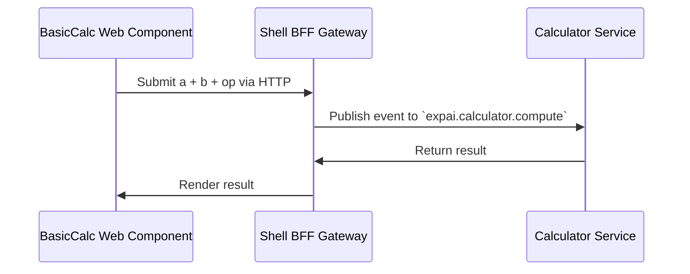

# 📙 Guide: Basic Calculator Plugin

## Overview

This guide describes the interaction and usage patterns of the `expai-basic-calculator` module within the ExperimentalAIApp. It defines the architecture, component boundaries, data flow, and usage intent for both backend and frontend.

---

# 🧩 Use Case

Users enter two numbers and select an arithmetic operation. The result is computed in the backend and returned asynchronously to the frontend, which displays it.

---

## System Context

* **Frontend:** Angular Web Component (`basic-calculator-mf`)
* **Backend:** Vert.x microservice (`basic-calculator-service`)
* **Comms Layer:** Vert.x EventBus + optional HTTP bridge via shell

---

## User Flow



---

## Event Contract

* **Request**: `expai.calculator.compute`

```json
{
  "a": 3,
  "b": 2,
  "op": "multiply"
}
```

* **Response**

```json
{
  "result": 6
}
```

---

## Frontend Details

* Web Component registered as `<expai-basic-calc>`
* UI:

  * Inputs for A and B
  * Select operation: `+`, `-`, `*`, `/`
  * Result display panel
* Behavior:

  * Fires event to BFF on submit
  * Handles result and errors
* Hosted standalone or embedded in shell

---

## Backend Details

* Vert.x 5 EventBus listener
* Stateless service
* Each operation handled in-memory, synchronous
* Exposes readiness/liveness for:

  * EventBus listener health
  * Event loop metrics
* Uses service loader to register its compute handler

---

## Dev/Test Notes

* Frontend may be served via `ng serve`
* Shell dev proxy must include path to service for local BFF bridge
* Backend test suite uses Testcontainers + JUnit
* Frontend flow test via BrowserStack + Cypress

---

Ready to implement backend microservice.
